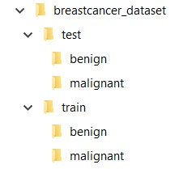

# Breast Cancer Classification
## Inspiration
Breast cancer is the most common form of cancer in women. Accurately identifying and categorizing breast cancer subtypes is an important clinical task, and automated methods can be used to save time and reduce error.

In our project we used CNN and transfer learning to classify breast cancer images into malignant tumors and benign.

# Data
The dataset can be downloaded from here: 
https://www.kaggle.com/datasets/paultimothymooney/breast-histopathology-images

The dataset contains 2 classes:
1. Benign Tumor - 
  Benign tumors are those that stay in their primary location without invading other sites of     the body. Benign tumors tend to grow slowly and have distinct borders.
2. Malignant Tumor-
  Malignant tumors are cancerous cells that grow uncontrollably and spread locally and/or to       distant sites. Malignant tumors can spread rapidly and require treatment to avoid spread. If they are caught early, treatment is likely will be  more simple and with good react.

I split the data as shown:

 

with 80 % train and 20% test (that will split later to 20% validation).

Train size: 2067, that splits to 1512 images to malignant folder, and 555 images in benign folder.

Validation size: 517, that splits to 378 images in malignant folder, and 139 images in benign folder.

# Environment and packages
1. Jupyter Notebook
2. Numpy
3. Pandas
4. Scikit-image
5. Matplotlib
6. Scikit-learn
7. Keras

# Required installations
pip install numpy pandas scikit-image matplotlib scikit-learn keras jupyter notebook

# Model-ResNet50:

# Results
## Loss/Accuracy per epoch

The model is able to reach a validation accuracy of 80% :

## Correct/Incorrect classification samples

# Project files:
 •readme_images folder- images for readme discription.
 
 •breast_cancer_classification.ipynb- classification model for breast cancer dataset.
 
 •split.ipynb- code to split the full dataset (with malingnant and benign classes) to train and test folders. 
 
 •files_name.txt- contain the amount and the names of the data images after the split.

