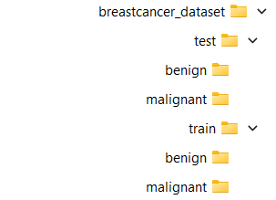
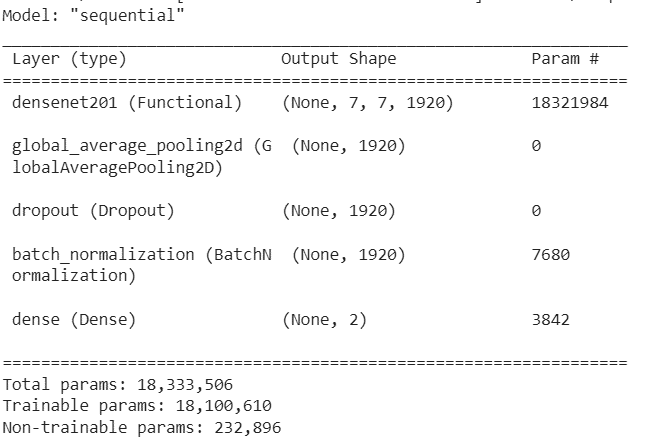
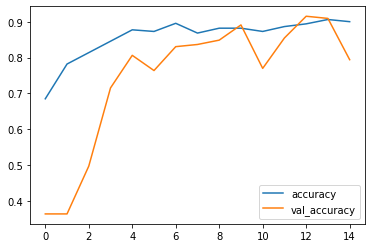
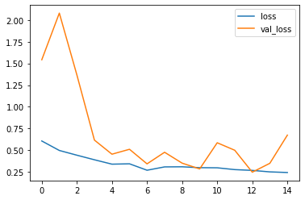
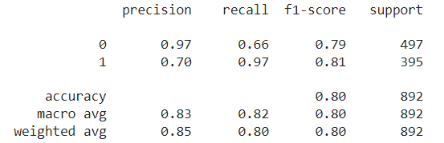
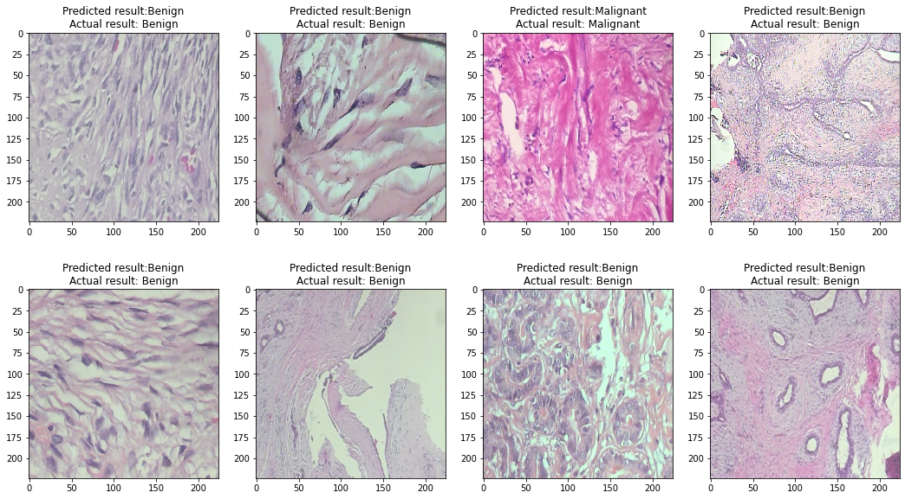

# breastcancer_classification
Breast Cancer Classification using CNN and transfer learning (using resnet)

# Data
The dataset can be downloaded from here: 
https://www.kaggle.com/datasets/paultimothymooney/breast-histopathology-images

I split the data as shown:

# Environment and packages
1. Jupyter Notebook
2. Numpy
3. Pandas
4. Scikit-image
5. Matplotlib
6. Scikit-learn
7. Keras

# Required installations
pip install numpy pandas scikit-image matplotlib scikit-learn keras jupyter notebook

# Model

# Results
## Loss/Accuracy per epoch

The model is able to reach a validation accuracy of 80% :

## Correct/Incorrect classification samples

